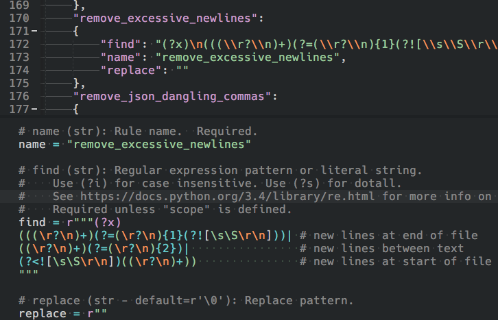

# About RegReplace

## Overview

RegReplace is a Sublime Text plugin that allows creating commands consisting of sequences of find and replace
instructions.

## Features

-   Create find and replace rules that can then be used to create Sublime Commands to call at any time.
-   Chain multiple regular expression find and replace rules together.
-   Create rules that can filter regular expression results by syntax scope.
-   Create rules that target specific scopes and apply regular expression to the content.
-   Create commands that highlight results and require confirmation before replacing.
-   Create find and fold/unfold commands to fold or unfold the found results instead of replacing them.
-   Create find and mark/unmark commands to simply highlight or unhighlight results instead of replacing them.
-   Create advanced commands that can run a plugin to do more complex replaces.
